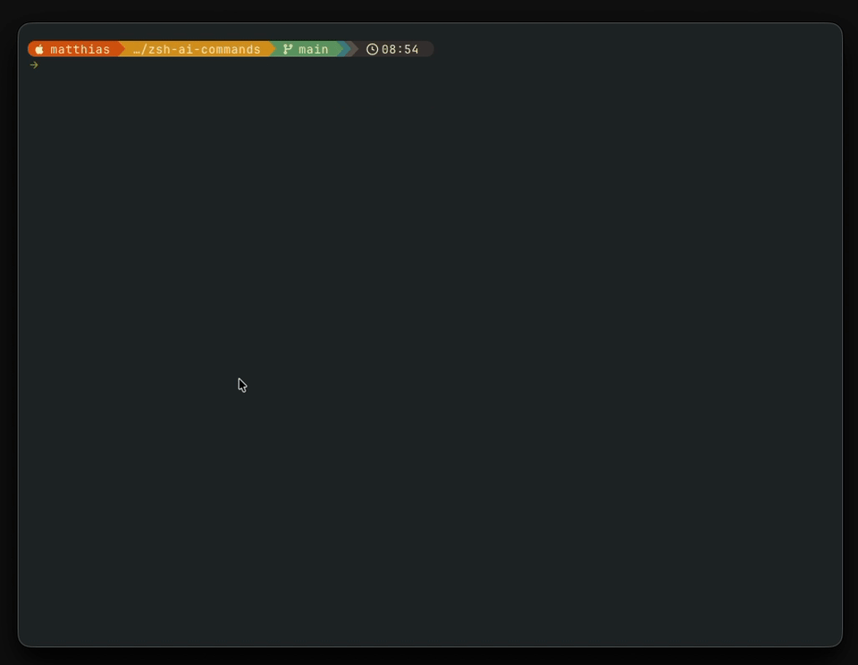

# ZSH AI Commands



This plugin works by asking GPT (default: _gpt-4o_) for terminal commands that achieve the described target action.

To use it just type what you want to do (e.g. `list all files in this directory`) and hit the configured hotkey (default: `Ctrl+o`).
When GPT responds with its suggestions just select the one from the list you want to use.

## Requirements

- [curl](https://curl.se/)
- [fzf](https://github.com/junegunn/fzf)
  - note: you need a recent version of fzf (the apt version for example is fairly old and will not work)
- awk
- [jq](https://jqlang.github.io/jq/)

## Installation

### oh-my-zsh

Clone the repository to you oh-my-zsh custom plugins folder:

```sh
git clone https://github.com/mmeister86/zsh-ai-commands ${ZSH_CUSTOM:=~/.oh-my-zsh/custom}/plugins/zsh-ai-commands
```

Enable it in your `.zshrc` by adding it to your plugin list:

```
plugins=(... zsh-ai-commands ...)
```

Set the API key by either:

1. Creating a config file (recommended):

```sh
mkdir -p ~/.config/zsh-ai-commands
echo "sk-xxxxxxxxxxxxxxxxxxxxxxxxxxxxxxxxxxxxxxxxxxxxxxxx" > ~/.config/zsh-ai-commands/api_key
chmod 600 ~/.config/zsh-ai-commands/api_key
```

2. Setting the environment variable (for backward compatibility):

```
ZSH_AI_COMMANDS_OPENAI_API_KEY="sk-xxxxxxxxxxxxxxxxxxxxxxxxxxxxxxxxxxxxxxxxxxxxxxxx"
```

Replace the placeholder with your own key.
If using the environment variable in your `.zshrc`, be careful to not leak the key should you be sharing your config files.

## Model Selection

Supported OpenAI models: `gpt-4o`, `gpt-4o-mini`, `gpt-4-turbo`, `gpt-4`, `gpt-3.5-turbo`

### Default Model

Configure the default model via config file:

```sh
mkdir -p ~/.config/zsh-ai-commands
echo "LLM_MODEL=gpt-4o-mini" > ~/.config/zsh-ai-commands/config
```

Or set the `ZSH_AI_COMMANDS_LLM_NAME` environment variable.

### Interactive Selection

Press `Ctrl+L` (or your configured `ZSH_AI_COMMANDS_LLM_HOTKEY`) to interactively select a model via fzf before sending the request.

## Error Handling

- 30 second timeout for API requests
- Automatic retry (up to 2 attempts) on network errors and server errors
- Clear error messages for various failure cases
- Debug logging available via `ZSH_AI_COMMANDS_DEBUG=true`

## Configuration Variables

| Variable                         | Default         | Description                                                                             |
| -------------------------------- | --------------- | --------------------------------------------------------------------------------------- |
| `ZSH_AI_COMMANDS_OPENAI_API_KEY` | `-/-` (not set) | OpenAI API key (optional if `~/.config/zsh-ai-commands/api_key` exists)                 |
| `ZSH_AI_COMMANDS_HOTKEY`         | `'^o'` (Ctrl+o) | Hotkey to trigger the request                                                           |
| `ZSH_AI_COMMANDS_LLM_HOTKEY`     | `'^l'` (Ctrl+l) | Hotkey for interactive LLM model selection                                              |
| `ZSH_AI_COMMANDS_LLM_NAME`       | `gpt-4o`        | LLM name                                                                                |
| `ZSH_AI_COMMANDS_N_GENERATIONS`  | `5`             | Number of completions to ask for                                                        |
| `ZSH_AI_COMMANDS_EXPLAINER`      | `true`          | If true, GPT will comment the command                                                   |
| `ZSH_AI_COMMANDS_HISTORY`        | `false`         | If true, save the natural language prompt to the shell history (and atuin if installed) |
| `ZSH_AI_COMMANDS_DEBUG`          | `-/-` (not set) | If set to `true`, enables debug logging                                                 |

## Known Bugs

- [x] Sometimes the commands in the response have to much / unexpected special characters and the string is not preprocessed enough. In this case the fzf list stays empty.
- [ ] The placeholder message, that should be shown while the GPT request is running, is not always shown. For me it only works if `zsh-autosuggestions` is enabled.
